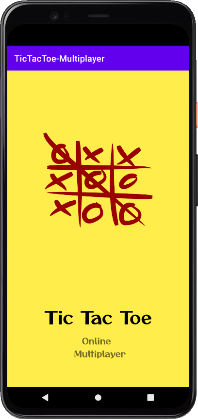
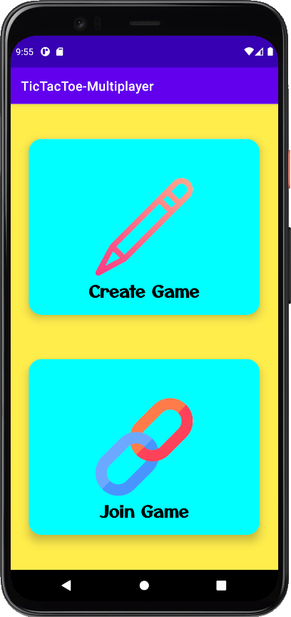
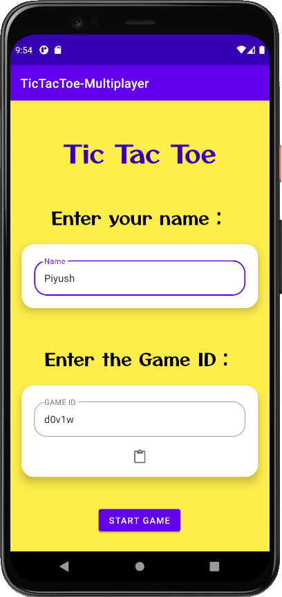
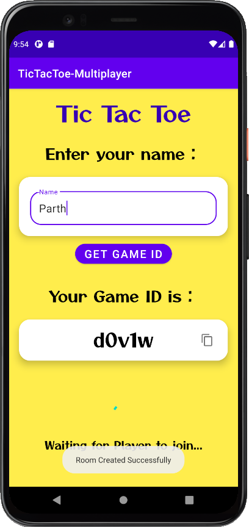
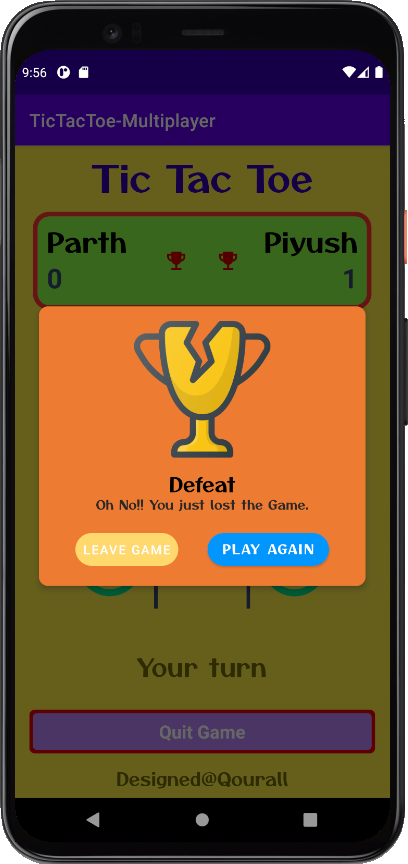
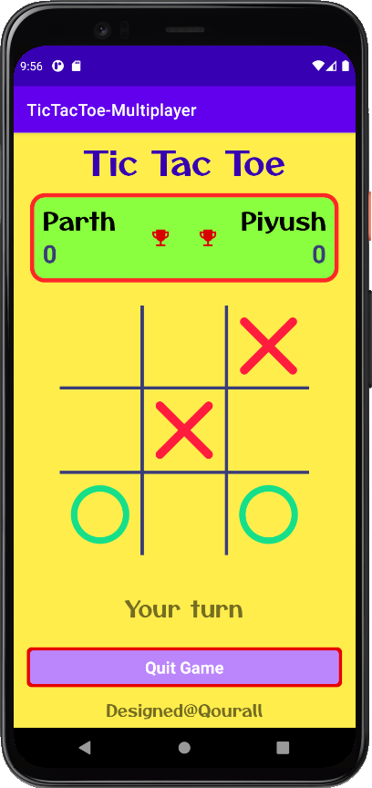
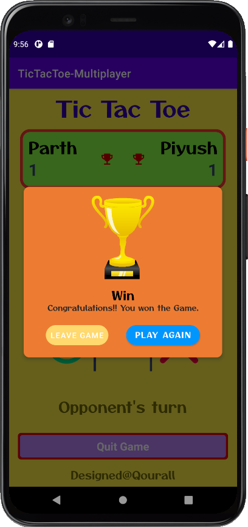

# TicTacToe-Multiplayer

The classic Tic-Tac-Toe game for Android using __Kotlin__. It uses Google's __Firebase Realtime Database__.

## What is used here

- ConstraintLayout
- Kotlin
- Firebase Realtime Database
- LifeCycle
- ViewModel

## Screenshots

| | | | |
|:----:|:----:|:----:|:----:|
|  |  |  |  |

| | | | |
|:----:|:----:|:----:|:----:|
| |  |  |  | 

<!-- 

 -->
